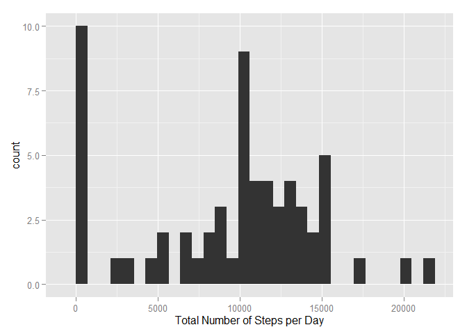
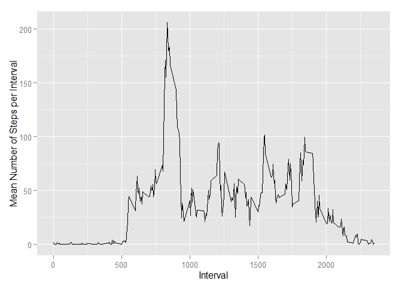
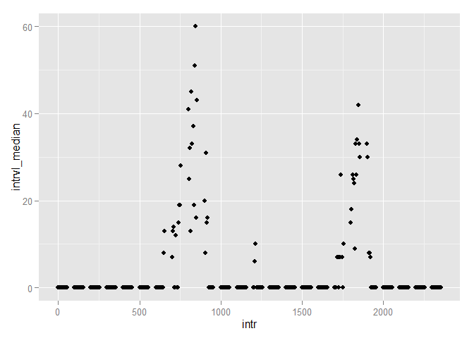

# Reproducible Research: Peer Assessment 1


## Loading and preprocessing the data

```r
echo=TRUE
library(ggplot2)
```

```
## Warning: package 'ggplot2' was built under R version 3.0.3
```

```r
#
data<-read.csv("activity.csv")
dates<-unique(data$date)
ok<-complete.cases(data$steps, data$date)
data_ok<-data[ok,]
```


## What is mean total number of steps taken per day?


```r
step <- 1:length(dates)
for(i in 1:length(dates)){
        step[i]<-sum(data_ok$steps[data_ok$date == dates[i]])
}
#    
```
a histogram of the total number of steps taken each day

```r
ggplot(NULL, aes(x=step))+
        geom_histogram()
```

```
## stat_bin: binwidth defaulted to range/30. Use 'binwidth = x' to adjust this.
```

 
mean  of the total number of steps taken per day

```r
mean(step)
```

```
## [1] 9354.23
```
 median of the total number of steps taken per day

```r
median(step)
```

```
## [1] 10395
```

## What is the average daily activity pattern?


```r
intr<-unique(data_ok$interval)  # the 5 minute interval values used
#
# Calculate the means for each interval
#
intrvl_mean<-1:length(intr)
for(i in 1:length(intr)){
        intrvl_mean[i]<-mean(data_ok$steps[data_ok$interval == intr[i]])
}
#
#
plot(ggplot(NULL,aes(x=intr, y=intrvl_mean))+
        geom_point())
```

 

```r
max_ave_steps<-intr[which(intrvl_mean==max(intrvl_mean))]  # interval with the maximum average number of steps
```

## Imputing missing values

```r
num_missing_values<-sum(!ok)

########################################## INPUT MISSING VALUES ###########################################
###########################################################################################################
## Fill in the missing step values with the median values for that time interval and put in DF data_p_mssng #
###########################################################################################################
# Calculate the median for each interval
#
intrvl_median<-1:length(intr)
for(i in 1:length(intr)){
        intrvl_median[i]<-median(data_ok$steps[data_ok$interval == intr[i]])
}
#
#
ggplot(NULL,aes(x=intr, y=intrvl_median)) + geom_point()
```

 


```r
empty_indx <- which(!ok)
#
data_p_mssng <- data
#
for(i in 1:length(empty_indx)){
        value <- empty_indx[i] %% 288
        if(value == 0) value <- 288
        data_p_mssng$steps[empty_indx[i]] <- intrvl_mean[value]
}     
#
#
step_mssng <- 1:length(dates)
for(i in 1:length(dates)){
        step_mssng[i]<-sum(data_p_mssng$steps[data_p_mssng$date == dates[i]])
}
#        
ggplot(NULL, aes(x=step_mssng))+
        geom_histogram()
```

```
## stat_bin: binwidth defaulted to range/30. Use 'binwidth = x' to adjust this.
```

 

```r
mean(step_mssng)
```

```
## [1] 10766.19
```

```r
median(step_mssng)
```

```
## [1] 10766.19
```


## Are there differences in activity patterns between weekdays and weekends?

```r
data_p_mssng$date<-as.Date(data_p_mssng$date)
day<-weekdays(data_p_mssng$date)
endday<-day == "Sunday" | day == "Saturday"
day[endday] <- "weekend"
day[!endday] <- "weekday"
#
data_p_mssng$day <- day
data_p_mssng$day<-factor(data_p_mssng$day)
#
daywk<-1:length(intr)
intrvl_mean<-1:length(intr)
for(i in 1:length(intr)){
        intrvl_mean[i]<-mean(data_p_mssng$steps[data_p_mssng$interval == intr[i]&data_p_mssng$day=="weekend"])
        daywk[i] <-"weekend"
}
tend<-data.frame(intr)
tend$intrvl_mean<-intrvl_mean
tend$daywk<-daywk
#
for(i in 1:length(intr)){
        intrvl_mean[i]<-mean(data_p_mssng$steps[data_p_mssng$interval == intr[i]&data_p_mssng$day=="weekday"])
        daywk[i]<-"weekday"
}
tday<-data.frame(intr)
tday$intrvl_mean<-intrvl_mean
tday$daywk<-daywk
#
##intr
#
dfmssng<-rbind(tend, tday)
#
dfmssng$daywk<-factor(dfmssng$daywk)
#
plt<-ggplot(dfmssng, aes(x=intr, y=intrvl_mean)) + geom_point()
plt + facet_grid(daywk ~ .)
```

 
